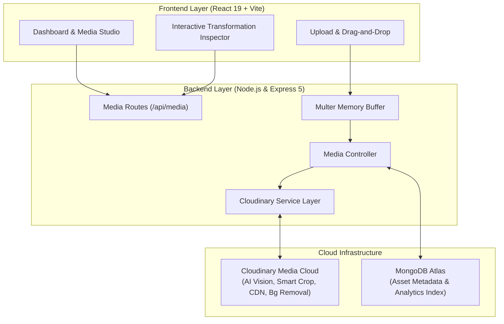

# SmartMedia AI — Intelligent Media Management Engine

[](https://hackindia.xyz)
[](https://cloudinary.com)
[](https://react.dev)
[](https://expressjs.com)
[](https://mongodb.com)
[](LICENSE)

An end-to-end intelligent media processing and asset management platform built for the **HackIndia Cloudinary Track**. SmartMedia AI automates asset ingestion, AI-driven contextual cropping, automated background removal, media moderation, dynamic CDN delivery, and structured tagging.

---

## Architecture Overview



---

## Key Features

### 1. Zero-Disk Buffer Streaming
Uploads are processed via in-memory buffers directly to Cloudinary using standard streams, preventing ephemeral disk bloat and server-side memory leaks.

### 2. AI-Driven Smart Cropping
Detects points of interest and subject faces dynamically using Cloudinary's `g_auto` gravity engine, allowing one-click adaptation for squares, banners, portrait cards, and custom dimensions without losing focal composition.

### 3. Automated Background Removal
Integrated background segmentation removes complex backdrops in real-time, delivering clean transparent assets ready for eCommerce, marketing collaterals, and avatars.

### 4. Content Moderation & AI Tagging
Runs uploaded assets through automated moderation checks and auto-tagging algorithms, ensuring brand safety and searchable media categorisation out-of-the-box.

### 5. Dynamic Optimization (`f_auto`, `q_auto`)
Delivers responsive media with optimal format conversion (AVIF/WebP) and compression based on the client browser and network bandwidth, minimizing latency and egress consumption.

### 6. Cloudinary Agent Skills Specification
Equipped with verified agent skills (`cloudinary-docs`, `cloudinary-next`, `cloudinary-react`, `cloudinary-transformations`) locked under `skills-lock.json` to guide continuous engineering and best-practice asset delivery.

---

## Directory Structure

```text
smartmedia-ai/
├── backend/
│   ├── config/             # Cloudinary SDK & MongoDB connection setups
│   ├── controllers/        # Media controller business logic
│   ├── middleware/         # Multer in-memory upload & error handlers
│   ├── models/             # Mongoose schema for media records
│   ├── routes/             # RESTful media endpoints
│   ├── services/           # Cloudinary SDK integration service
│   ├── utils/              # Helper utilities
│   ├── .env.example        # Environment variables template
│   ├── package.json        # Backend dependencies & scripts
│   └── server.js           # Server bootstrap & lifecycle
├── frontend/
│   ├── public/             # Static public assets
│   ├── src/
│   │   ├── assets/         # App icons & images
│   │   ├── components/     # UI components (MediaCard, UploadBox, Navbar)
│   │   ├── pages/          # Dashboard, Library, MediaDetails, Upload
│   │   ├── services/       # Frontend API client
│   │   ├── utils/          # Cloudinary URL formatters
│   │   ├── App.jsx         # App component
│   │   └── main.jsx        # App entry point
│   ├── .env.example        # Frontend environment template
│   ├── package.json        # Frontend dependencies & scripts
│   └── vite.config.js      # Vite build configuration
├── skills/                 # Cloudinary AI Agent skills
│   ├── cloudinary-docs/
│   ├── cloudinary-next/
│   ├── cloudinary-react/
│   └── cloudinary-transformations/
├── skills-lock.json        # Skill integrity and origin manifest
├── .gitignore              # Production-grade Git ignore rules
├── package.json            # Monorepo runner scripts
└── README.md               # Project documentation
```

---

## API Endpoints Reference

| Method | Endpoint | Description |
|---|---|---|
| `POST` | `/api/media/upload` | Upload single media asset directly to Cloudinary |
| `GET` | `/api/media` | Fetch paginated media items with filtering |
| `GET` | `/api/media/search` | Search media assets by tags, format, or query |
| `GET` | `/api/media/:id` | Retrieve single media item details |
| `POST` | `/api/media/:id/crop` | Generate smart cropped transformation URL |
| `POST` | `/api/media/:id/remove-background` | Apply AI background removal |
| `POST` | `/api/media/:id/moderate` | Trigger content moderation check |
| `POST` | `/api/media/:id/transform` | Apply custom transformations (effects, filters, scaling) |
| `PATCH` | `/api/media/:id/metadata` | Update tags and custom asset metadata |
| `DELETE` | `/api/media/:id` | Remove asset from MongoDB and Cloudinary |
| `GET` | `/api/health` | Service health status check |

---

## Quickstart & Installation

### Prerequisites
- [Node.js](https://nodejs.org) (v18 or higher)
- [MongoDB](https://www.mongodb.com/) (Local instance or MongoDB Atlas URI)
- [Cloudinary Account](https://cloudinary.com) (Cloud Name, API Key, API Secret)

### 1. Clone the Repository
```bash
git clone https://github.com/yashika-1406/SmartMedia-AI.git
cd SmartMedia-AI
```

### 2. Configure Environment Variables

**Backend (`backend/.env`):**
```bash
cp backend/.env.example backend/.env
```
Fill in your credentials:
```env
PORT=5000
NODE_ENV=development
MONGODB_URI=mongodb+srv://<username>:<password>@cluster0.mongodb.net/smartmedia?retryWrites=true&w=majority
CLOUDINARY_CLOUD_NAME=your_cloudinary_cloud_name
CLOUDINARY_API_KEY=your_cloudinary_api_key
CLOUDINARY_API_SECRET=your_cloudinary_api_secret
CLIENT_URL=http://localhost:5173
```

**Frontend (`frontend/.env`):**
```bash
cp frontend/.env.example frontend/.env
```
```env
VITE_API_URL=http://localhost:5000/api
```

### 3. Install Dependencies
```bash
# Install backend dependencies
cd backend
npm install

# Install frontend dependencies
cd ../frontend
npm install

cd ..
```

### 4. Start Development Servers

**Run Backend:**
```bash
cd backend
npm run dev
```
Backend runs on `http://localhost:5000`.

**Run Frontend:**
```bash
cd frontend
npm run dev
```
Frontend runs on `http://localhost:5173`.

---

## HackIndia Submission Highlights

- **Cloudinary AI Capabilities Utilized**: Real-time asset manipulation, smart crop with focal tracking, AI background segmentation, structured tagging, and format auto-negotiation.
- **Enterprise-Grade Security**: Environment credentials isolated through `.env.example` templates; all secrets excluded from source control.
- **Modern Standards**: React 19 concurrent features, Vite bundling, Express 5 REST API, and structured Mongoose schemas.
